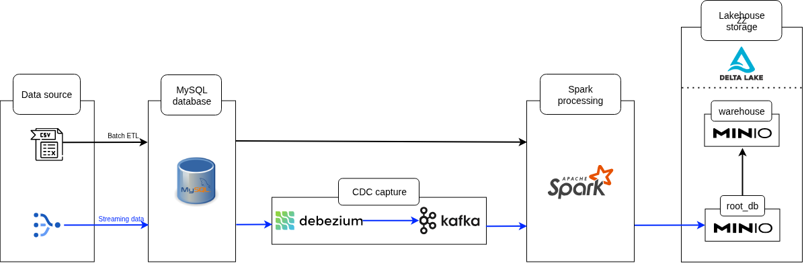
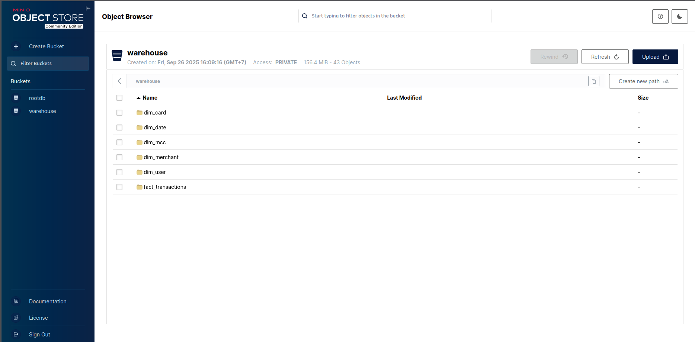
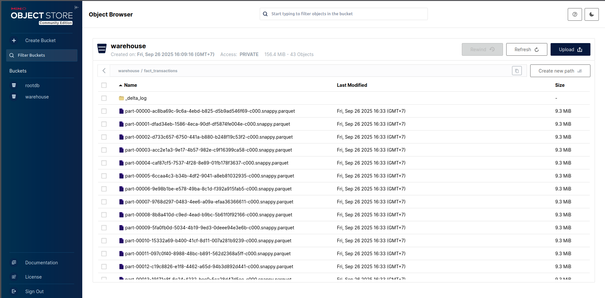
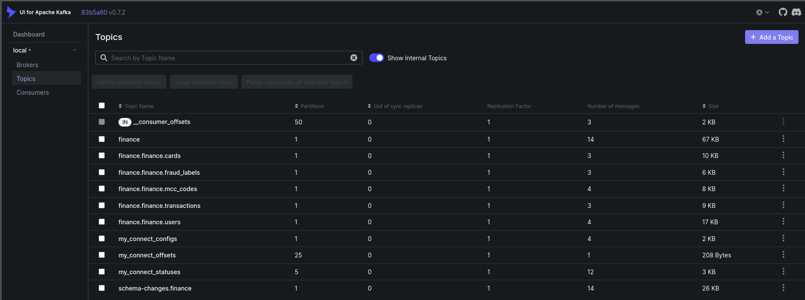
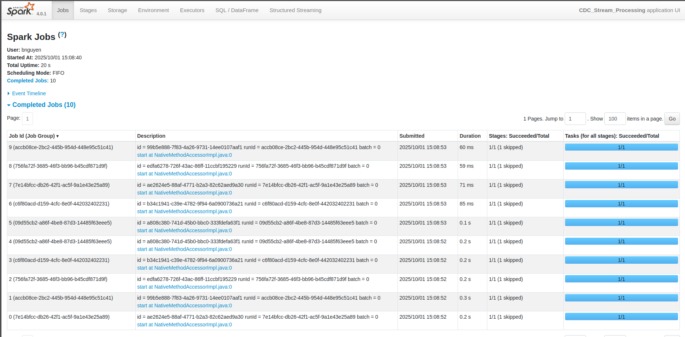
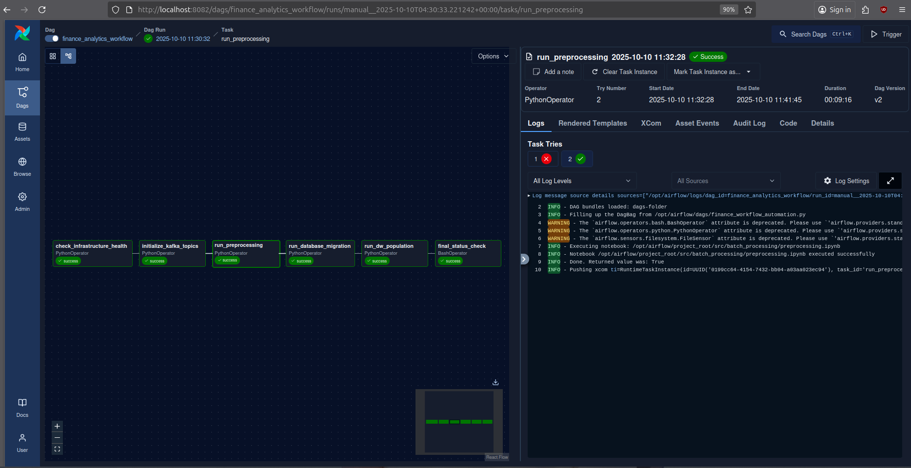
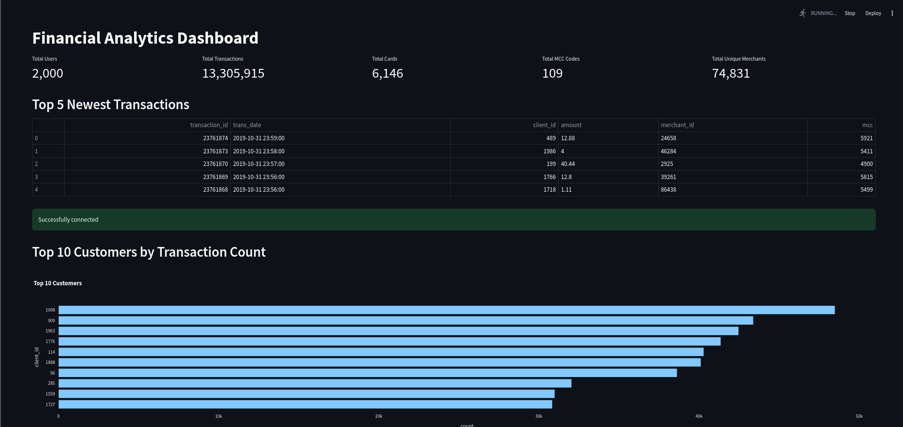

# Finance analytics platform

## 1. Project Overview

This project demonstrates a complete, end-to-end, modern data lakehouse platform for financial analytics. The primary goal is to showcase a robust architecture capable of capturing, processing, and analyzing financial data in near real-time, moments after it's generated in the source database.

Instead of waiting for nightly batch reports, this system allows financial analysts and stakeholders to monitor transaction patterns, detect fraud, and analyze customer behavior minute-by-minute. It showcases an entire workflow, from a new transaction being recorded in MySQL to its impact appearing in analytics dashboards, all within seconds. This platform is a prime example of a streaming-first **Lakehouse architecture** for financial services.

## 2. Project Goals & Key Features

This project is designed to enable real-time analytics for financial data by implementing **Change Data Capture (CDC)** to automatically capture INSERTs, UPDATEs, and DELETEs from the **MySQL** source without changing application code. It supports multi-table financial processing for complex schemas such as transactions, users, cards, MCC codes, and fraud labels, and it applies **stateful stream processing** so analytics logic can maintain context across micro-batches. The platform follows a lakehouse pattern on object storage (**Delta Lake** on **MinIO**) to combine the flexibility of a data lake with the reliability and performance of a data warehouse. All services are fully containerized with **Docker** and **Docker Compose** for consistent deployments, and the architecture is designed to scale using **Kafka** and **Spark** to handle larger data volumes as needed.

## 3. Architecture Diagram

The system's data flow follows a modern Lakehouse architecture for financial analytics with both batch and streaming processing capabilities.

```
BATCH PROCESSING:
Raw Data ──▶ MySQL ──▶ MinIO_rootdb_bucket ──▶ MinIO_lakehouse
             │                                      │
             │                                      │
             ▼                                      ▼
      +----------------+                     +-----------------+
      │   Source OLTP  │                     │ Delta Lake      │
      │   Database     │                     │ Tables          │
      +----------------+                     +-----------------+

STREAMING PROCESSING:
Streaming Data ──▶ MySQL ──▶ Debezium ──▶ Kafka ──▶ Spark Streaming ──▶ MinIO
                      │           │          │           │                │
                      │           │          │           │                │
                      ▼           ▼          ▼           ▼                ▼
            +----------------+ +---------+ +--------+ +----------+ +-----------+
            │   Source OLTP  │ │  CDC    │ │ Events│  │ Real-time│ │ Delta Lake│
            │   Database     │ │Connector│ │Topics │  │Processing│ │ Tables    │
            +----------------+ +---------+ +--------+ +----------+ +-----------+
```



## 4. Technology Stack

| Category | Technology | Version (Example) | Role in Project |
| :--- | :--- | :--- | :--- |
| **Containerization** | Docker, Docker Compose | v20+ | Packages, defines, and orchestrates all services. |
| **Database** | MySQL | 8.0 | Source Online Transaction Processing (OLTP) database for financial data. |
| **CDC** | Debezium | 2.5+ | Captures and streams database changes to Kafka. |
| **Message Queue** | Apache Kafka | 3.6+ | Central hub for ingesting and distributing financial data events. |
| **Data Processing** | Apache Spark | 3.5.0 | Processes data streams from Kafka, applies financial analytics logic, and writes to Delta Lake. |
| **Data Lake** | MinIO, Delta Lake | latest, 3.1.0 | Stores financial data as structured, versioned Delta tables. |
| **Query Engine** | Dremio | latest | Fast query engine and data catalog that exposes Delta Lake tables via Flight/JDBC/ODBC and provides dataset reflections for performance. |
| **BI / Visualization** | Superset | 3.x+ | Business intelligence platform for SQL exploration, dashboards and visualizations; connects to Dremio as a data source. |
| **Auxiliary Tools** | Kafka UI, MinIO Console | latest | Web UIs for managing and monitoring Kafka and MinIO. |
| **Workflow Orchestration** | Apache Airflow | 2.8+ | Orchestrates and automates the finance analytics workflows, including batch processing and infrastructure management. |
| **Dashboard** | Streamlit | latest | Interactive web application for real-time financial analytics and visualizations. |

## 5. Directory Structure
```
/
├── infra/                    # Infrastructure as Code
│   ├── docker-compose.yml   # The main file; defines all services, networks, and volumes.
│   ├── start_infra.sh       # Startup script that initializes the platform and CDC.
│   ├── config/              # Configuration files for Debezium connectors.
│   └── database/            # Database schemas, scripts, and initialization data.
│       ├── schema.sql       # SQL statements for the initial database schema.
│       └── scripts/         # Database maintenance and initialization scripts.
│   └── streamlit/           # Interactive financial dashboard application.
│       ├── app.py          # Main Streamlit application for real-time analytics.
│       └── Dockerfile      # Docker configuration for Streamlit service.
├── src/                     # Source code for data processing.
│   └── stream_processing/   # Contains Python scripts for Spark streaming.
│       └── rootdb_stream.py # The main Spark job; processes financial data streams.
├── datasets/                # Sample financial datasets for testing.
├── docs/                    # Documentation and requirements.
└── README.md               # This file.
```

## 6. Detailed Setup & Running Guide

### Prerequisites
-   [Docker](https://docs.docker.com/engine/install/ubuntu/) and [Docker Compose](https://docs.docker.com/compose/install/) are installed and running on Ubuntu 25.04.
-   Git for cloning the repository.
-   A stable internet connection to download Docker images and packages.
-   Ensure your user is in the `docker` group to run Docker commands without sudo: `sudo usermod -aG docker $USER` (then log out and back in).

### Step 1: Clone the Project
```shell
git clone <YOUR_REPOSITORY_URL>
cd finance_analytics
```

### Step 2: Configure Docker Resources
To ensure Docker has enough resources to run all services smoothly, especially Spark, you may need to adjust Docker's resource limits. On Ubuntu, you can configure this through Docker Desktop settings or by editing `/etc/docker/daemon.json`:
```json
{
  "memory": "12g",
  "cpus": "4.0"
}
```
Restart Docker after changes: `sudo systemctl restart docker`.

### Step 3: Start the Infrastructure Services
This command will start all background services. The first time you run this, it may take several minutes to download the necessary images.
```shell
# Make the startup script executable
chmod +x infra/start_infra.sh

# Start all services and initialize CDC
./infra/start_infra.sh
```
After it finishes, verify that all containers are up and running:
```shell
docker compose ps
```

### Step 4: Verify Platform Health
After the startup script completes, confirm that the core services are running and healthy. The script initializes the MySQL schema, registers the Debezium CDC connector, and creates the Kafka topics used by the pipeline. Start by listing the containers to check their status and any healthchecks:

```shell
docker compose ps
```

To confirm the Debezium connector is running and to inspect its task state, request the connector status endpoint:

```shell
curl localhost:8083/connectors/finance-mysql-connector/status | jq
```

Verify the Kafka topics required by the pipeline exist and are accessible by querying the broker:

```shell
docker exec kafka kafka-topics.sh --bootstrap-server kafka:9092 --list
```

If any service appears unhealthy or a check fails, inspect the corresponding container logs to diagnose the issue, for example:

```shell
docker logs -f <service_name>
```

Replace `<service_name>` with the relevant container name such as `connect`, `kafka`, `mysql`, `dremio`, or `superset` when investigating failures.

### Step 5: Load Sample Financial Data (Optional)
To populate the system with sample data for testing:
```shell
# The startup script already initializes topics with dummy data
# Or manually run the initialization script
docker exec -i mysql mysql -u root -proot123 finance < infra/database/scripts/initialize_topics.sql
```

### Step 6: Run the Spark Streaming Job
Start the main financial data processing script. This script will run continuously, listening to Kafka and writing processed data to MinIO Delta Lake.
```shell
# Run the streaming processor (adjust paths as needed)
python src/stream_processing/rootdb_stream.py
```
This terminal will now display the Spark processing logs showing financial data being processed.

### Step 8: Automate with Airflow (Optional)
For production deployments, use Apache Airflow to automate the entire workflow:

1. **Start Airflow**: Airflow is included in your Docker setup
2. **Trigger Automation**: Run `./infra/airflow/scripts/trigger_workflow.sh`
3. **Monitor Progress**: Visit `http://localhost:8080` to track execution

The Airflow DAG (`infra/airflow/dags/finance_workflow_automation.py`) handles:
- Infrastructure health checks
- Kafka topic initialization
- One-time notebook executions
- Scheduled data updates
- Streaming job management

## 7. Accessing the User Interfaces (UIs)
Once all services are running, you can access the various UIs from your local machine's web browser.

### MinIO Console (Data Lake)
-   **URL:** `http://localhost:9901`
-   **Credentials:** `minioadmin` / `minioadmin123`
-   **Description:** Browse the buckets and data files in your Data Lake. Navigate to the `warehouse` bucket to see the `transactions`, `users`, `cards` Delta tables.





### Kafka UI (Message Queue)
-   **URL:** `http://localhost:9089`
-   **Description:** Manage topics, view financial transaction messages as they are produced by Debezium, and monitor the health of the Kafka cluster.



### Spark UI (Data Processing)
-   **URL:** `http://localhost:4040`
-   **Description:** Monitor the Spark streaming job, view job stages, tasks, and performance metrics for the financial data processing.



### Airflow UI (Workflow Orchestration)
-   **URL:** `http://localhost:8080`
-   **Description:** Monitor DAG execution, view logs, and manage finance analytics workflows.



### MySQL Database (Source Data)
-   **Host:** `localhost:30306`
-   **Credentials:** `root` / `root123`
-   **Description:** Connect directly to the source MySQL database to view or modify financial data.

### Streamlit Dashboard (Financial Analytics)
-   **URL:** `http://localhost:8501`
-   **Description:** Interactive dashboard displaying real-time financial metrics, transaction volumes, and customer analytics from the Delta Lake.



## 8. Troubleshooting Common Issues
- **`pull access denied` error during `docker compose up`:**
  - This is usually caused by Docker Hub's rate limiting. The most reliable fix is to create a free Docker Hub account and run `docker login` in your terminal.
- **Spark job crashes with `Py4JException` or `OutOfMemoryError`:**
  - This is a resource issue. Ensure you have configured Docker resource limits (Step 2) and allocated enough memory to Docker. You can also increase the memory allocated to the Spark driver/executor in the streaming script.
- **Debezium connector shows `FAILED` status:**
  - Check the connector logs with `docker logs connect`. Common issues include incorrect database credentials or missing CDC permissions on MySQL tables.
- **Data is not appearing in Delta Lake:**
  - Check the pipeline step-by-step: 1. Is the Debezium connector in a `RUNNING` state? 2. Are new messages appearing in the relevant Kafka topic (use Kafka UI)? 3. Is the Spark job processing new batches? 4. Check Spark logs for any processing errors.

## 9. Future Roadmap
This financial analytics platform can be extended with many real-world applications:
-   **Real-time Fraud Detection:** Build machine learning models to detect suspicious transaction patterns using streaming data.
-   **Customer Behavior Analytics:** Analyze spending patterns and provide personalized financial insights.
-   **Risk Assessment Engine:** Calculate real-time credit risk scores based on transaction history.
-   **Regulatory Reporting:** Automate compliance reporting with real-time data aggregation.
    -   **Multi-tenant Architecture:** Support multiple financial institutions with isolated data processing.

## 10. References and resources

- Dataset (Kaggle): Transactions Fraud Datasets — https://www.kaggle.com/datasets/computingvictor/transactions-fraud-datasets
- Dremio — Delta Lake format documentation: https://docs.dremio.com/cloud/sonar/query-manage/supported-data-formats/delta-lake/
- Superset + Dremio connection resources:
  - Superset + Dremio Docker image (AlexMerced): https://github.com/AlexMercedCoder/dremio-superset-docker-image/blob/main/dockerfile
  - Superset database connection guide: https://superset.apache.org/docs/configuration/databases/


